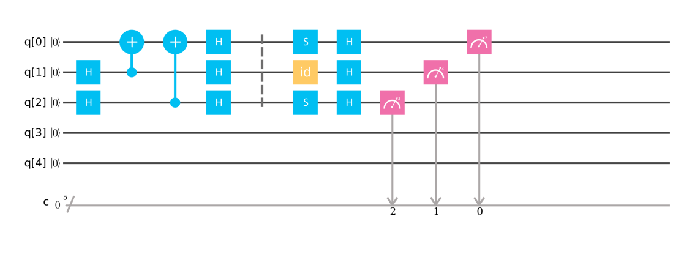

# E6998QC - Quantum Computing

My final project (though not a big project) is presented in the [Project/](./Project/) folder.

It is about an implementation of Mermin-GHZ game (GHZ state is 3-state entanglement (compared to 2-state EPR)) in Qiskit.

Validation of fidelity test on IBM's Q-Experience (5-qubit machine) is also included in the report. Code is in Jupyter Notebook.

A small screenshot of the quantum circuit example of the Mermin-GHZ game:

